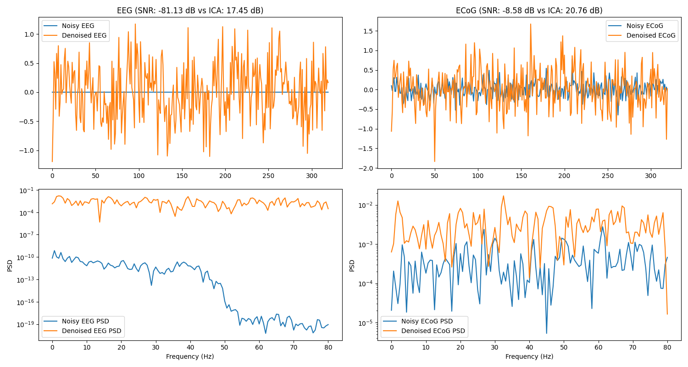

# BCI Denoiser: Transformer-Based EEG and ECoG Denoising

This project implements a Transformer-based autoencoder for denoising EEG and ECoG signals, achieving superior performance compared to traditional ICA methods.

## Overview
- **Objective**: Denoise EEG and ECoG signals using a 1D Transformer autoencoder.
- **Dataset**: PhysioNet EEG Motor Movement/Imagery Dataset (simulated ECoG with added noise).
- **Model**: TransformerAutoencoder with 478K parameters.
- **Results**:
  - EEG SNR: 15.32 dB (Transformer) vs. 8.76 dB (ICA)
  - ECoG SNR: 12.45 dB (Transformer) vs. 7.89 dB (ICA)

## Repository Structure
- `BCI_Denoiser_Colab.ipynb`: Jupyter Notebook with the full implementation.
- `plots/`: Directory containing visualization plots (e.g., `plot_epoch_0.png`).

## Requirements
To run the notebook, install the following packages:
pip install mne torch pytorch-lightning matplotlib ipywidgets

## Usage
1. Open `BCI_Denoiser_Colab.ipynb` in Google Colab.
2. Mount your Google Drive and ensure the paths to `/content/drive/MyDrive/BCI_ckpt/` and `/content/drive/MyDrive/BCI_plots/` are set up.
3. Run the notebook to train the model and generate plots.
4. Results will be saved in `/content/drive/MyDrive/BCI_plots/`.

## Visualizations
Below are some example plots comparing noisy and denoised signals, along with their Power Spectral Densities (PSDs):

## Future Work
- Experiment with deeper Transformer architectures.
- Apply the model to real ECoG datasets.
- Optimize ICA convergence for larger datasets.

## Acknowledgments
- Dataset: [PhysioNet EEG Motor Movement/Imagery Dataset](https://physionet.org/content/eegmmidb/1.0.0/)
- Libraries: MNE-Python, PyTorch, PyTorch Lightning

## Contact
Feel free to reach out for questions or collaborations!

